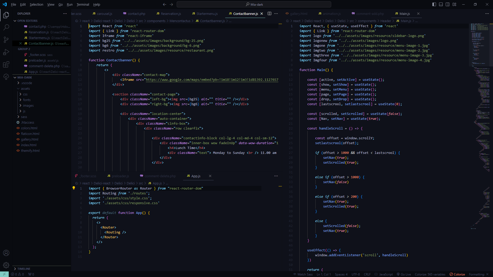
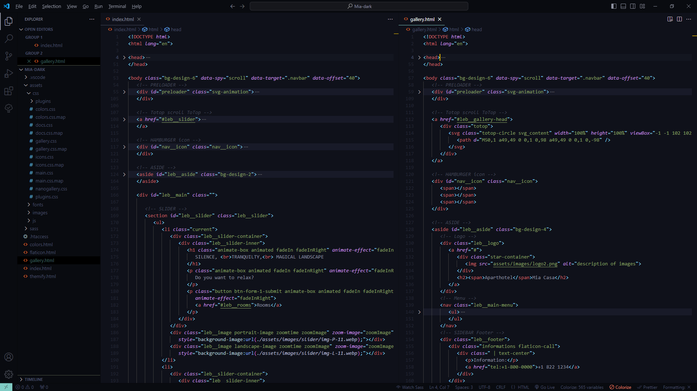
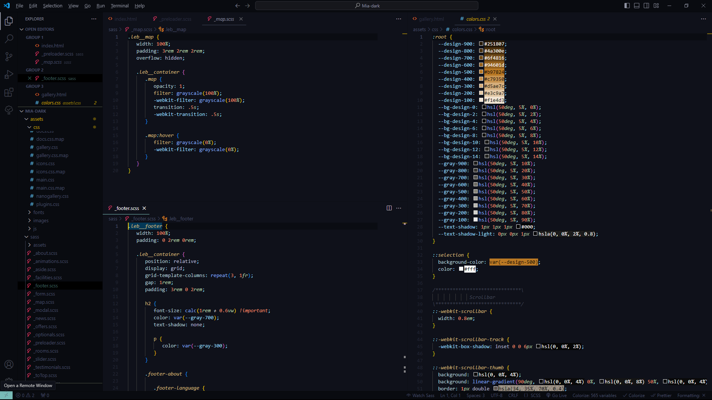
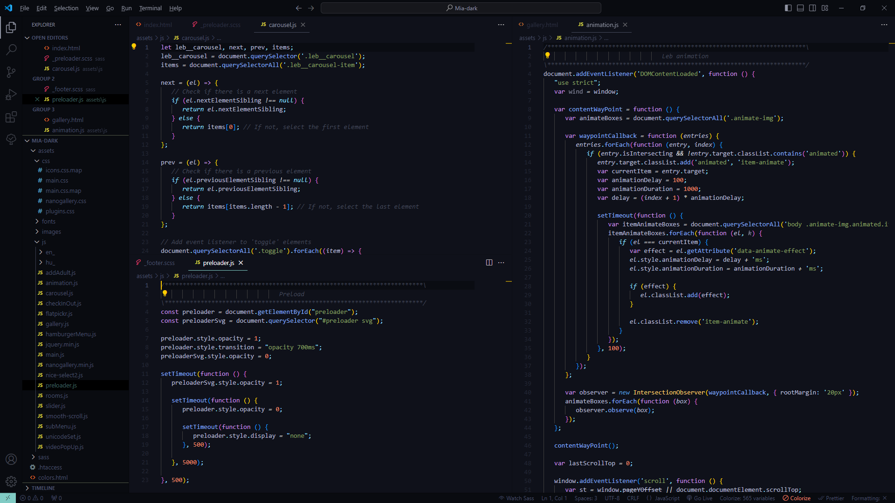
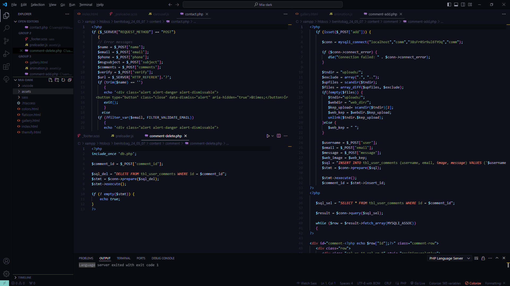

# Individal VSCode Themes

For those who like bright colors.

## Steps to Install the VS Code Theme

1. **Backup Original Files**

First, save the `themes` directory, as well as the `package.json` and `package.nls.json` files from the following location:
c:/Users/your/AppData/Local/Programs/Microsoft VS Code/resources/app/extensions/theme-defaults

Save these files to a secure location. This will allow you to restore the original state if needed.

2. **Delete and Replace Files**

Once you have backed up the original files, delete them from the specified location and replace them with the new files you want to use.

Ensure that the new files are placed in the same directory:
c:/Users/your/AppData/Local/Programs/Microsoft VS Code/resources/app/extensions/theme-defaults

This will update your VS Code with the new theme files.

---
## Preview
#### REACT

#### HTML

#### CSS SASS

#### JS

#### PHP

## Copyright and License

Copyright 2024 Lebryere. Code released under the 

